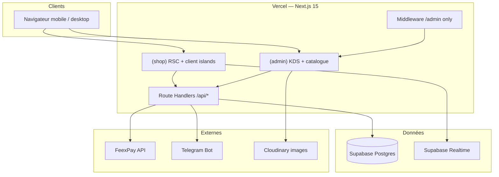
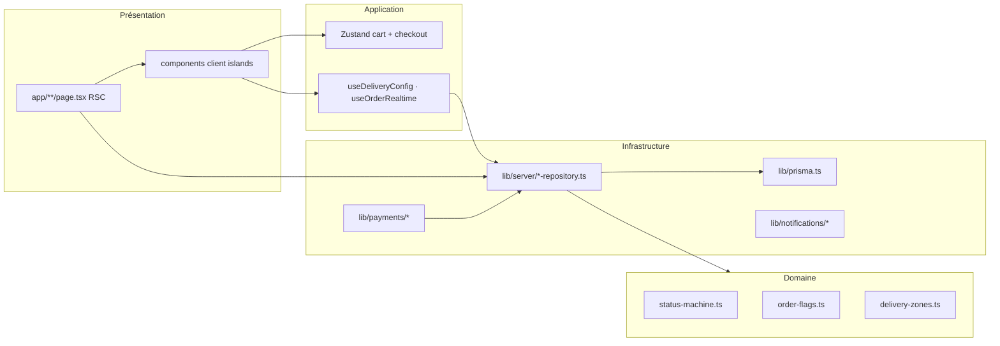
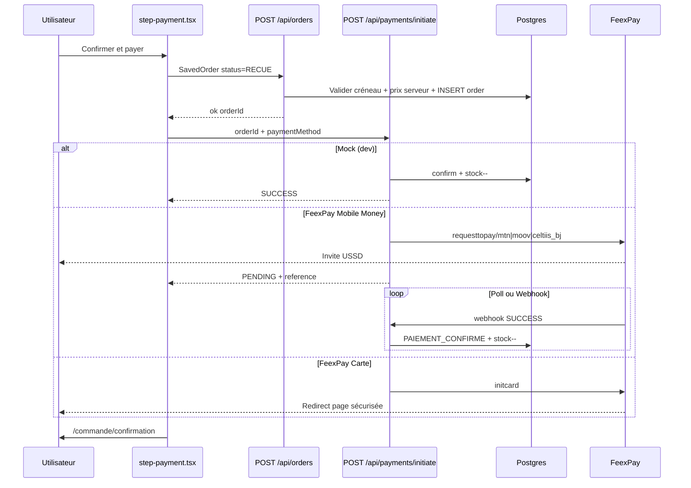
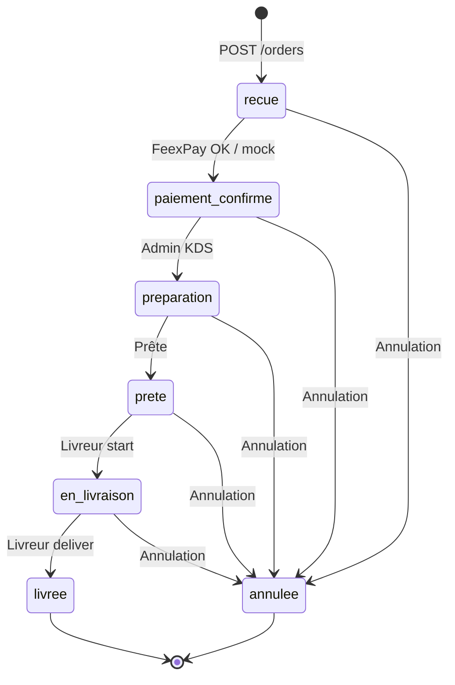
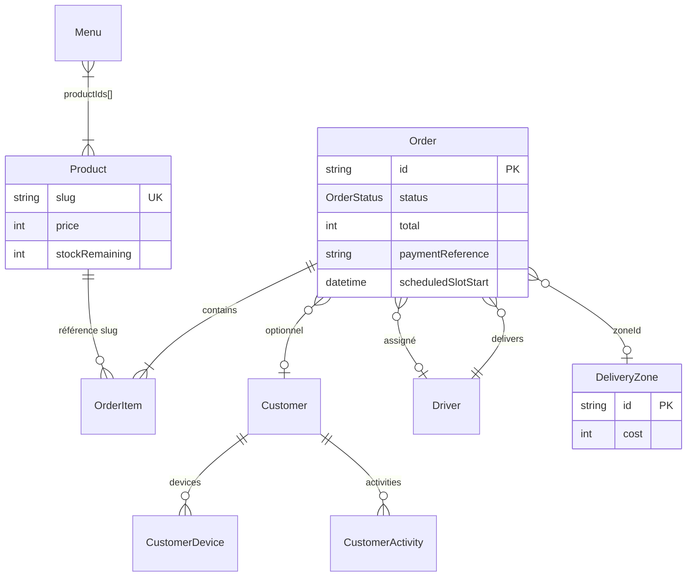
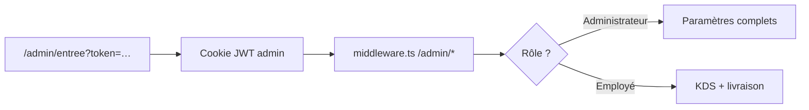
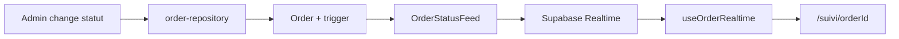
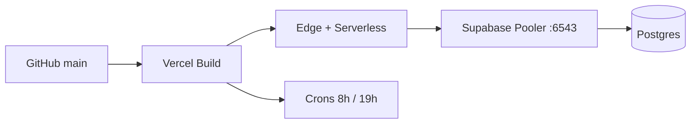

# Gift & ENTREMETS — Architecture technique

> Document d'architecture du monorepo **GLACE** (marque Ah Mes Goûts).  
> Complète [`SIMPLICITE-ET-SCALABILITE.md`](./SIMPLICITE-ET-SCALABILITE.md) (simplicité & charge 1000 users).

**Projet Vercel** : `gift-entremets` · **Repo** : `ah-mes-gouts`  
**Date** : juillet 2026

---

## 1. Vue d'ensemble

Application **e-commerce premium** (glaces & entremets, Cotonou) : catalogue → panier → checkout → paiement Mobile Money / carte → suivi temps réel. Back-office intégré (KDS, produits, menus, livraison, livreurs).



### Principes architecturaux

| Principe | Implémentation |
|----------|----------------|
| **Server-first** | Pages shop en RSC ; `"use client"` seulement pour interactivité |
| **Source de vérité serveur** | Prix, stock, zones, créneaux recalculés côté API |
| **Idempotence commandes** | Header `Idempotency-Key` + statuts stricts |
| **Stock après paiement** | Commande `RECUE` → FeexPay → `PAIEMENT_CONFIRME` + décrément stock |
| **Guest checkout** | Pas de compte obligatoire ; CRM léger par téléphone |
| **Modularité RESTAFY-ready** | Repositories Prisma isolés, peu de couplage fort |

---

## 2. Stack technique

| Couche | Technologie | Version / note |
|--------|-------------|----------------|
| Framework | Next.js (App Router) | 15.x |
| UI | React | 19 |
| Langage | TypeScript | strict |
| Styles | Tailwind CSS | v4 via `@theme` dans `globals.css` |
| Animations | Framer Motion | `motion/react`, imports optimisés |
| ORM | Prisma | 6.x |
| Base | PostgreSQL | Supabase managé |
| Auth admin | JWT cookies + tokens magiques | Edge middleware |
| Paiements | FeexPay | MTN / Moov / Celtiis / carte |
| Realtime | Supabase | `OrderStatusFeed` |
| Images prod | Cloudinary (+ local `public/`) | AVIF/WebP via `next/image` |
| Déploiement | Vercel | Node 24.x, région EU recommandée |
| Icônes | Lucide React | uniquement |

---

## 3. Structure du dépôt

```
GLACE/
├── app/                          # Next.js App Router
│   ├── layout.tsx                # Root : fonts, metadata SEO
│   ├── globals.css               # Design tokens Tailwind v4
│   ├── (shop)/                   # Boutique publique
│   │   ├── layout.tsx            # Header + chrome différé (Server)
│   │   ├── page.tsx              # Landing (ISR 120s)
│   │   ├── catalogue/
│   │   ├── produit/[slug]/
│   │   ├── checkout/
│   │   ├── commande/confirmation/
│   │   ├── suivi/[orderId]/
│   │   ├── zones-de-livraison/
│   │   ├── infos/ · contact/
│   ├── (admin)/                # Back-office
│   │   ├── layout.tsx
│   │   └── admin/              # KDS, produits, menus, clients, paramètres…
│   ├── livreur/[accessToken]/  # Portail livreur (token URL)
│   ├── admin/entree/           # Route entrée admin (magic link)
│   └── api/                    # Route Handlers REST
│       ├── orders/ · cart/ · delivery/ · payments/
│       ├── admin/ · livreur/ · crm/ · cron/
│       └── health/ · menu/ · analytics/
│
├── components/
│   ├── shop/                     # UI boutique (landing, checkout, cart…)
│   ├── admin/                    # UI admin (KDS, produits…)
│   ├── livreur/                  # Portail livreur
│   ├── seo/                      # JsonLd, metadata helpers
│   └── ui/                       # Primitives (shadcn-style)
│
├── lib/
│   ├── server/                   # Repositories & auth (Node runtime)
│   ├── payments/                 # FeexPay, confirmation
│   ├── delivery/                 # Slots, zones, types
│   ├── orders/                   # Machine à états, flags
│   ├── hooks/                    # useDeliveryConfig, useOrderRealtime…
│   ├── cart-store.ts             # Zustand panier
│   └── checkout-store.ts         # Zustand checkout
│
├── prisma/
│   ├── schema.prisma
│   └── migrations/
│
├── public/images/                # Assets statiques (produits, ops, brand)
├── scripts/                      # Deploy, seed, sync zones, images
├── types/                        # Types métier partagés
├── middleware.ts                 # Garde admin uniquement
├── vercel.json                   # Crons, headers cache, redirects
└── next.config.ts                # Images, optimizePackageImports
```

---

## 4. Surfaces applicatives

### 4.1 Boutique `(shop)` — 10 pages

| Route | Type | Cache | Rôle |
|-------|------|-------|------|
| `/` | RSC | ISR 120 s | Landing hero + menu du jour |
| `/catalogue` | RSC + client filtres | ISR 300 s | Grille produits |
| `/produit/[slug]` | RSC | ISR 300 s | Fiche + panneau achat |
| `/checkout` | RSC + wizard client | ISR 120 s | Parcours 6 étapes |
| `/commande/confirmation` | Client | — | Reçu post-paiement |
| `/suivi/[orderId]` | RSC + Realtime | — | Suivi statut |
| `/zones-de-livraison` | RSC | ISR | SEO zones A–E |
| `/infos` · `/contact` | RSC | — | Infos boutique |

### 4.2 Admin `(admin)` — 16 pages

| Zone | Routes | Rôle |
|------|--------|------|
| **Ops** | `/admin/commandes`, `/admin/cockpit` | KDS, KPIs |
| **Catalogue** | `/admin/produits`, `/admin/menus` | Stock, menu journalier |
| **Clients** | `/admin/clients`, `/admin/clients/[id]` | CRM léger |
| **Livraison** | `/admin/parametres/livraison`, `/admin/parametres/boutique` | Zones, créneaux, horaires |
| **Équipe** | `/admin/livreurs`, `/admin/parametres/utilisateurs` | Livreurs, tokens admin |
| **Système** | `/admin/donnees`, journal, notifications, promotions | Export, logs, alertes |

### 4.3 Livreur

| Route | Auth | Rôle |
|-------|------|------|
| `/livreur/[accessToken]` | Token URL unique | Liste courses du jour, démarrer / livrer / injoignable |

### 4.4 API — ~43 routes (groupées)

<details>
<summary><strong>Boutique (chemin critique)</strong></summary>

| Méthode | Route | Rôle |
|---------|-------|------|
| GET | `/api/delivery/config` | Zones, horaires, options (cache 60 s) |
| POST | `/api/cart/validate-stock` | Validation stock pré-paiement |
| POST | `/api/orders` | Créer commande + réserver créneau |
| GET | `/api/orders/[id]/tracking` | DTO suivi client |
| GET | `/api/payments/config` | `mock` ou `feexpay` |
| POST | `/api/payments/initiate` | Lancer paiement / mock |
| GET | `/api/payments/initiate?reference=` | Poll statut FeexPay |
| POST | `/api/payments/feexpay/webhook` | Callback serveur FeexPay |
| GET | `/api/menu/active` | Menu du jour actif |

</details>

<details>
<summary><strong>Admin</strong></summary>

| Préfixe | Exemples |
|---------|----------|
| `/api/admin/orders` | Liste, changement statut, assignation livreur |
| `/api/admin/products` | CRUD catalogue |
| `/api/admin/menus` | Menus journaliers |
| `/api/admin/delivery` | Config livraison |
| `/api/admin/customers` | CRM |
| `/api/admin/auth` | Magic link admin |
| `/api/admin/data` | Export données |
| `/api/admin/upload` | Images Cloudinary |

</details>

<details>
<summary><strong>Livreur · CRM · Infra</strong></summary>

| Préfixe | Rôle |
|---------|------|
| `/api/livreur/[token]/orders/*` | start, deliver, unreachable |
| `/api/crm/*` | OTP, link device, activity (phase 2) |
| `/api/cron/*` | activate-menus (8h), telegram-daily (19h) |
| `/api/telegram/webhook` | Inscription bot Telegram |
| `/api/analytics/visit` | Compteur visiteurs |
| `/api/health` | Santé DB |

</details>

---

## 5. Couches logicielles



### Repositories serveur (`lib/server/`)

| Module | Responsabilité |
|--------|----------------|
| `order-repository.ts` | CRUD commandes, stock transactionnel, statuts |
| `order-pricing.ts` | Recalcul prix/stock depuis catalogue (anti-fraude) |
| `order-mapper.ts` | Prisma ↔ `SavedOrder` |
| `admin-catalog-repository.ts` | Produits admin + shop |
| `shop-catalog.ts` | Catalogue boutique + `unstable_cache` 120 s |
| `menu-repository.ts` | Menus journaliers, activation |
| `delivery-config-repository.ts` | Zones A–E, horaires, options |
| `slot-bookings.ts` | Disponibilité créneaux |
| `site-settings-repository.ts` | Réglages boutique (JSON) |
| `customer-service.ts` | CRM clients par téléphone |
| `admin-auth.ts` / `admin-auth-edge.ts` | Auth admin Node vs Edge |
| `image-upload.ts` | Upload Cloudinary |

---

## 6. Flux métier — commande & paiement

### 6.1 Parcours checkout (6 étapes UI)

```
mode → [zone] → schedule → client → upsell → payment → confirmation
         ↑                              ↑
    si delivery                    1 clic skip
```

**Stores** : `checkout-store.ts` (persist LocalStorage), `cart-store.ts`.

### 6.2 Séquence commande (état cible)



### 6.3 Règles anti-fraude (serveur)

- Montants client **ignorés** → `priceOrderItems()` recalcule depuis le catalogue.
- Frais livraison depuis **zone active en DB**, pas le front.
- Stock décrémenté **uniquement** après `confirmOrderPayment()`.
- Rate limit : 5 commandes / min / IP (`lib/rate-limit.ts`).
- Idempotence : header `Idempotency-Key` sur `POST /api/orders`.

---

## 7. Machine à états — commande



| Statut | Code Prisma | Visible client |
|--------|-------------|----------------|
| Reçue | `RECUE` | En attente paiement |
| Paiement confirmé | `PAIEMENT_CONFIRME` | Confirmée |
| Préparation | `PREPARATION` | En préparation |
| Prête | `PRETE` | Prête |
| En livraison | `EN_LIVRAISON` | En route |
| Livrée | `LIVREE` | Livrée |
| Annulée | `ANNULEE` | Annulée |

Fichier : `lib/orders/status-machine.ts`.

---

## 8. Modèle de données (Prisma)

### 8.1 Entités principales



### 8.2 Tables auxiliaires

| Table | Rôle |
|-------|------|
| `DeliverySchedule` | Horaires par jour / type (delivery, pickup) |
| `DeliveryOptions` | `maxOrdersPerSlot`, `bookingDaysAhead`, adresse retrait |
| `Menu` | Menu journalier (`SCHEDULED` → `ACTIVE` → `EXPIRED`) |
| `SiteSettingsStore` | JSON réglages boutique |
| `OrderStatusFeed` | **Realtime** — id = orderId, status only (sans PII) |
| `AdminActionLog` | Journal actions admin |
| `SiteVisitorDay` | Analytics visiteurs (cookie `amg_vid`) |
| `TelegramSubscriber` | Chat IDs alertes commandes |
| `CustomerOtp` | OTP récupération historique (CRM phase 2) |

### 8.3 Zones livraison (grille officielle)

Source : affiches ops `public/images/ops/livraison/zone-*.webp` + `lib/delivery-zones.ts`.

| ID | Tarif (FCFA) | Exemples |
|----|--------------|----------|
| `zone-e` | 500 | Fidjrossè centre, Calvaire, Sème City… |
| `zone-d` | 700 | Agla, Cadjèhoun, Haie Vive… |
| `zone-c` | 800 | Ganhi, Tokpa, St Michel… |
| `zone-b` | 1000 | Segbèya, Habitat, Calavi… |
| `zone-a` | 1500 | Tankpè, Zone Ambassades… |

Horaires livraison : **13h–19h** (DB + affiches).

---

## 9. Authentification & sécurité

### 9.1 Admin



| Fichier | Runtime | Rôle |
|---------|---------|------|
| `middleware.ts` | Edge | Garde routes `/admin/*` |
| `lib/server/admin-auth-edge.ts` | Edge | Lecture cookies, rôles |
| `lib/server/admin-auth.ts` | Node | Validation tokens, login |
| `lib/server/admin-tokens.ts` | Node | Tokens magiques, expiration |

Variables : `ADMIN_ACCESS_TOKENS`, `ADMIN_DEV_OPEN` (dev only).

### 9.2 Livreur

- Auth par **token URL** (`Driver.accessToken`) — pas de compte.
- API : `/api/livreur/[accessToken]/orders/*`.

### 9.3 Client boutique

- **Aucune auth obligatoire** (guest checkout).
- Device key `amg_vid` (LocalStorage + cookie) pour CRM / analytics.
- PII minimale : nom, téléphone, adresse — pas de mot de passe.

### 9.4 Durcissements

| Mesure | Où |
|--------|-----|
| `X-Content-Type-Options: nosniff` | `vercel.json` |
| Clés API jamais exposées client | FeexPay, Supabase service role |
| IP hashée commandes | `Order.clientIpHash` |
| Rate limiting | `lib/rate-limit.ts` (→ Redis cible) |
| Validation Zod | API routes sensibles |
| Cron secret | `CRON_SECRET` sur `/api/cron/*` |

---

## 10. Cache & performance

### 10.1 Stratégie par couche

| Couche | Mécanisme | TTL |
|--------|-----------|-----|
| Pages shop | `export const revalidate` | 120–300 s |
| Catalogue | `unstable_cache` | 120 s, tag `catalog` |
| Config livraison API | `unstable_cache` + headers | 60 s + SWR 300 s |
| Assets `/images/*` | `vercel.json` Cache-Control | 1 an immutable |
| `/_next/static/*` | CDN Vercel | immutable |

### 10.2 Caches process-local (⚠️ à migrer)

| Cache | Fichier | Risque multi-instance |
|-------|---------|----------------------|
| Slots réservés | `slot-bookings.ts` | Surbooking |
| Idempotence | `order-idempotency.ts` | Doublons |
| Rate limit | `rate-limit.ts` | Contournable |
| Catalogue admin | `admin-catalog-repository.ts` | Stale |

→ Voir **P0** dans [`SIMPLICITE-ET-SCALABILITE.md`](./SIMPLICITE-ET-SCALABILITE.md).

### 10.3 Frontend

- Layout shop **Server Component** ; panier / curseur en `dynamic()` différé.
- Landing : sections sous le fold code-splittées.
- Checkout : étapes en `dynamic()` ; Framer réduit sur le chemin critique.
- Fonts : preload body seul (`lib/fonts.ts`).

---

## 11. Temps réel & notifications

### 11.1 Suivi commande client



Fichiers : `lib/hooks/use-order-realtime.ts`, migration trigger `OrderStatusFeed`.

### 11.2 Notifications

| Canal | Déclencheur | Fichier |
|-------|-------------|---------|
| Telegram | Nouvelle commande confirmée | `lib/notifications/telegram.ts` |
| SMS (mock) | Changement statut | `lib/notifications/order-notifications.ts` |
| Admin son | KDS Realtime + poll | `use-order-notifications.ts` |

---

## 12. Intégrations externes

| Service | Usage | Config env |
|---------|-------|------------|
| **FeexPay** | Paiement MTN/Moov/Celtiis/carte | `FEEXPAY_*` |
| **Supabase** | Postgres + Realtime | `DATABASE_URL`, `DIRECT_URL`, keys |
| **Cloudinary** | Upload images admin | Cloud name + API secret |
| **Telegram** | Alertes commandes | Bot token, webhook |
| **Vercel** | Hosting + crons | Projet `gift-entremets` |

### FeexPay — endpoints Bénin

| Méthode | Endpoint FeexPay |
|---------|------------------|
| MTN MoMo | `POST …/requesttopay/mtn` |
| Moov Money | `POST …/requesttopay/moov` |
| Celtiis | `POST …/requesttopay/celtiis_bj` |
| Carte | `POST …/initcard` |
| Statut | `GET …/single/status/{reference}` |

Implémentation : `lib/payments/feexpay.ts`.

---

## 13. Déploiement



| Élément | Valeur |
|---------|--------|
| Projet | `gift-entremets` |
| URL prod | `https://gift-entremets.vercel.app` |
| Domaine cible | `ahmesgouts.bj` |
| Node | 24.x |
| Build | `prisma generate && next build` |

Docs ops : [`DEPLOYMENT.md`](./DEPLOYMENT.md).

### Variables d'environnement (résumé)

| Groupe | Variables clés |
|--------|----------------|
| DB | `DATABASE_URL` (pooler 6543 + `pgbouncer=true`), `DIRECT_URL` |
| Supabase | `NEXT_PUBLIC_SUPABASE_URL`, anon key, service role |
| Admin | `ADMIN_ACCESS_TOKENS`, `CRM_OTP_PEPPER` |
| FeexPay | `FEEXPAY_ENABLE`, `SHOP_ID`, `API_KEY`, `CALLBACK_URL` |
| Site | `NEXT_PUBLIC_SITE_URL`, `CRON_SECRET` |
| Telegram | Bot token (webhook) |

---

## 14. Crons & tâches planifiées

| Cron | Schedule | Route | Rôle |
|------|----------|-------|------|
| Activation menus | `0 8 * * *` (8h UTC) | `/api/cron/activate-menus` | Passe menus `SCHEDULED` → `ACTIVE`, applique stock jour |
| Résumé Telegram | `0 19 * * *` (19h UTC) | `/api/cron/telegram-daily` | KPIs journaliers équipe |

Déclaration : `vercel.json`.

---

## 15. Design system (rappel)

| Token | Valeur | Usage |
|-------|--------|-------|
| Background | `#FAF7F5` | Fond crème |
| Primary | `#3B1F4D` | Violet profond |
| Secondary | `#F3C9CE` | Rose poudré |
| Accent | `#C9A96E` | Doré — CTA uniquement |
| Text | `#241726` | Texte principal |
| Success | `#6B8F71` | Commande confirmée |

Fonts : **Fraunces** (display) + **Plus Jakarta Sans** (UI) — `lib/fonts.ts`.

---

## 16. Évolutions prévues (architecture cible)

Aligné sur [`SIMPLICITE-ET-SCALABILITE.md`](./SIMPLICITE-ET-SCALABILITE.md) :

| Phase | Changement architectural |
|-------|-------------------------|
| **P0** | Redis/Upstash, slots atomiques DB, pool `connection_limit=1` |
| **P1** | Admin paginé, webhook-only paiement, queue notifications |
| **P2** | Supabase Small+, read replica reporting |
| **Simplicité** | 8 routes API shop, 4 écrans admin, retrait CRM OTP / landing morte |

---

## 17. Documents liés

| Document | Contenu |
|----------|---------|
| [`SIMPLICITE-ET-SCALABILITE.md`](./SIMPLICITE-ET-SCALABILITE.md) | Simplicité eau de roche + 1000 users |
| [`DEPLOYMENT.md`](./DEPLOYMENT.md) | Procédure déploiement Vercel / Supabase |
| [`README.md`](./README.md) | Démarrage local |
| [FeexPay API](https://docs.feexpay.me/api_rest.html) | Intégration paiement |

---

*Architecture document — maintenir à jour lors des changements schema, routes API ou flux paiement.*
