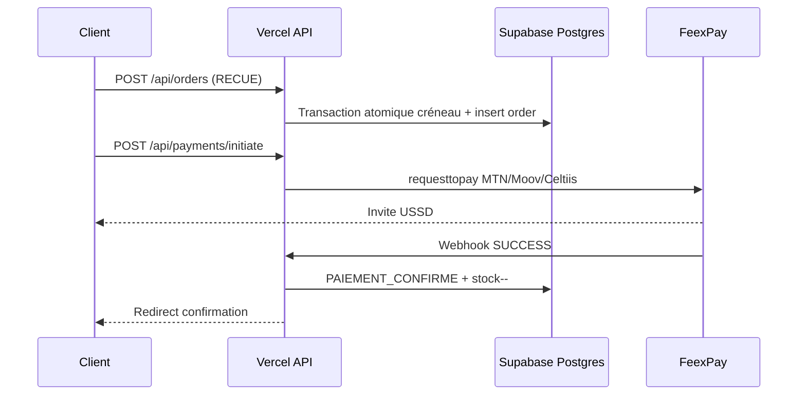

# Gift & ENTREMETS — Simplicité « eau de roche » & capacité 1000 utilisateurs

> Document de référence — recherche approfondie sur le système actuel, les fissures structurelles, et le plan pour une plateforme **ultra-épurée** qui tient **1000 personnes en même temps** sans casser.

**Stack** : Next.js 15 · React 19 · Prisma · Supabase Postgres · Vercel · FeexPay  
**Date** : juillet 2026

---

## 1. Philosophie : eau de roche

> *« La perfection est atteinte non pas lorsqu'il n'y a plus rien à ajouter, mais lorsqu'il n'y a plus rien à retirer. »* — Antoine de Saint-Exupéry

### Ce que ça veut dire ici

| Eau de roche | Pas eau de roche |
|--------------|------------------|
| Un parcours, une intention par écran | Multiplier les options « au cas où » |
| 4 moyens de paiement, pas 12 | Agrégateurs empilés, formulaires carte custom |
| Produit = photo + prix + ajouter | Filtres, onglets, badges, animations partout |
| Admin = voir commandes, préparer, livrer | CRM, cockpit, journal, analytics, OTP… |
| Le serveur décide (prix, stock, créneaux) | Logique dupliquée client + mock + DB |
| Cache edge pour la lecture | `force-dynamic` par défaut |

### Références marché (food premium + Afrique)

- **Checkout** : parcours linéaire, guest checkout, Mobile Money visible en premier ([Stripe](https://stripe.com/resources/more/ecommerce-checkout-best-practices), [VP0 / Flutterwave UI](https://vp0.com/blogs/flutterwave-payment-gateway-ui-mobile)).
- **Paiement** : jamais de clé API côté navigateur ; 3 états UI clairs — *en cours*, *validez sur votre téléphone*, *confirmé*.
- **Scale serverless** : pooler Postgres dès le jour 1, `connection_limit=1` par instance Vercel ([playbook Next.js + Supabase](https://www.iloveblogs.blog/guides/scaling-nextjs-supabase-0-to-100k-users-playbook)).
- **Design luxe food** : hero produit, peu de couleurs, peu de texte, une action principale par écran (règles projet Ah Mes Goûts).

---

## 2. État des lieux — le système aujourd'hui

### 2.1 Inventaire chiffré

| Métrique | Valeur | Commentaire |
|----------|--------|-------------|
| Pages (`page.tsx`) | **28** | ~10 boutique · ~16 admin · 1 livreur |
| Routes API | **~43** | ~30 % critiques boutique · ~70 % admin/ops |
| Composants `"use client"` | **~71** | Poids JS élevé sur le chemin chaud |
| Stores Zustand | **2** | Panier + checkout — **OK, à garder** |
| Caches `globalThis` | **6+** | **Fissure majeure** multi-instance Vercel |
| Pages ISR (shop) | **4** | `/`, `/catalogue`, `/produit/[slug]`, `/checkout` |
| Assets `public/` | **~62 Mo** | ~40 Mo exclus du deploy (`.vercelignore`) |
| Étapes checkout | **7** | mode → zone → créneau → client → upsell → paiement → confirmation |

### 2.2 Deux produits dans un seul repo

Le dépôt mélange aujourd'hui :

1. **Boutique premium** (10 pages) — ce que le client voit.
2. **Mini-ERP** (16 pages admin + CRM + analytics + Telegram + cockpit) — ce que l'équipe utilise.

Pour « eau de roche », la boutique doit rester **autonome et minimaliste**. L'admin doit être **réduit au strict ops** (commandes, produits, livraison, livreurs).

### 2.3 Parcours critique (happy path)

```
Accueil → Catalogue → Fiche produit → Panier → Checkout (6 étapes)
  → POST /api/orders (commande RECUE)
  → POST /api/payments/initiate (FeexPay ou mock)
  → [poll ou webhook] → PAIEMENT CONFIRME + stock
  → Confirmation → Suivi temps réel
```

**Appels API minimum par commande** : 3 (stock → order → paiement).  
**Maximum (Mobile Money en attente)** : ~43 (polling 3 s × 40 tentatives) — **à réduire**.

---

## 3. Les fissures — ce que le code révèle

> Les « craques » ne sont pas des bugs visibles en dev local. Ils apparaissent sous charge, multi-instance, ou en production sans FeexPay.

### 3.1 Critiques (cassent à l'échelle ou en prod)

| # | Fissure | Fichier(s) | Effet |
|---|---------|------------|-------|
| C1 | **État en RAM** (créneaux, idempotence, rate limit) | `lib/server/slot-bookings.ts`, `lib/server/order-idempotency.ts`, `lib/rate-limit.ts` | Surbooking créneaux, doubles commandes, rate limit contournable entre instances Vercel |
| C2 | **Pool Postgres non borné** | `lib/prisma.ts`, env `DATABASE_URL` | `too many connections` dès ~50–100 invocations serverless simultanées |
| C3 | **Paiement mock par défaut** | `app/api/payments/initiate/route.ts`, `FEEXPAY_ENABLE` | Prod peut confirmer sans vrai paiement |
| C4 | **Admin charge toutes les commandes** | `getAllServerOrders()` → `app/api/admin/orders/route.ts` | Full scan + items à chaque poll (20 s) — CPU DB spike |

### 3.2 Importantes (dégradation progressive)

| # | Fissure | Fichier(s) | Effet |
|---|---------|------------|-------|
| I1 | Double source catalogue (DB + mock) | `lib/mock-data.ts` (11 imports) | Stock/prix incohérents si produit absent de la DB |
| I2 | `getDeliveryConfig()` sans cache repository | `lib/server/delivery-config-repository.ts` | Requêtes DB à chaque commande |
| I3 | Polling paiement agressif | `components/shop/checkout/step-payment.tsx` | Charge API + FeexPay inutile |
| I4 | Realtime + poll admin redondants | `admin-orders-page.tsx` + `use-order-realtime.ts` | 2× la charge pour le KDS |
| I5 | Index manquant créneaux | `prisma/schema.prisma` | `countOrdersForSlot` lent sous charge |

### 3.3 Dette / bruit (complexité sans valeur client)

| # | Élément | Statut |
|---|---------|--------|
| D1 | **6–9 composants landing orphelins** | Jamais montés dans `landing-page.tsx` |
| D2 | **CRM OTP** (5 routes API) | Aucune UI consommatrice |
| D3 | **`/api/delivery/validate-slot`** | API morte — validation seulement à `POST /orders` |
| D4 | **`lib/payments/process-payment.ts`** | Legacy, quasi mort |
| D5 | **Three.js / WebGL hero** | +200 Ko JS, GPU, cold starts |
| D6 | **Curseur custom** | `custom-cursor.tsx` — zero valeur business |
| D7 | **Pages admin legacy** | Redirects doublons (`commandes`, `parametres/livraison`) |

---

## 4. Architecture cible — version eau de roche

### 4.1 Surface boutique (à garder — 6 pages)

| Page | Rôle | Cache |
|------|------|-------|
| `/` | Hero + menu du jour + teaser | ISR 120 s |
| `/catalogue` | Grille produits | ISR 300 s |
| `/produit/[slug]` | Fiche + achat | ISR 300 s |
| `/checkout` | Wizard 6 étapes | ISR 120 s (données upsell) |
| `/commande/confirmation` | Reçu | Dynamique |
| `/suivi/[orderId]` | Statut temps réel | Dynamique |

**Pages secondaires OK** : `/infos`, `/zones-de-livraison`, `/contact` (SEO, confiance).

### 4.2 API boutique (8 routes — pas une de plus)

| Route | Rôle |
|-------|------|
| `GET /api/delivery/config` | Zones, horaires, options (cache 60 s) |
| `POST /api/cart/validate-stock` | Stock avant paiement |
| `POST /api/orders` | Créer commande RECUE + réserver créneau |
| `POST /api/payments/initiate` | FeexPay / mock serveur |
| `GET /api/payments/initiate?reference=` | Poll statut (temporaire, puis webhook only) |
| `POST /api/payments/feexpay/webhook` | Confirmation serveur-à-serveur |
| `GET /api/payments/config` | `mock` ou `feexpay` (sans secrets) |
| `GET /api/orders/[id]/tracking` | Suivi client |

### 4.3 Admin minimal (4 écrans)

| Écran | Remplace |
|-------|----------|
| **Commandes (KDS)** | cockpit + commandes + notifications temps réel |
| **Produits & menus** | produits + menus + cron activation |
| **Livraison** | zones + créneaux + paramètres boutique |
| **Livreurs** | assignation + portail token |

**Reporter ou retirer** : CRM clients détaillé, journal actions, export données massif, analytics visites, OTP client.

### 4.4 Checkout épuré — règles UX

1. **Une décision par écran** — pas de formulaire géant.
2. **Récap visible** (sticky) — montant toujours lisible.
3. **Mobile Money en tête** — MTN, Moov, Celtiis, puis carte.
4. **État paiement explicite** — « Validez sur votre téléphone » avec spinner calme, pas d'animation agressive.
5. **Upsell = 1 écran, skip évident** — pas de dark pattern.
6. **Guest only** — pas de compte obligatoire (déjà le cas).

### 4.5 Schéma de flux paiement (cible)



**Règle d'or** : le stock ne bouge **qu'après** webhook ou statut SUCCESS confirmé.

---

## 5. Capacité 1000 utilisateurs simultanés

### 5.1 Définition réaliste

| Profil | 1000 users = | Charge DB |
|--------|--------------|-----------|
| **Navigation** (catalogue, accueil) | 1000 sessions lisant du cache ISR | **Faible** — Vercel CDN + edge |
| **Checkout actif** | 50–100 en même temps sur `/checkout` | **Élevée** — écritures + transactions |
| **Pic commande** (20h menu du jour) | 30–50 commandes / 5 min | **Pic** — créneaux + stock + FeexPay |

**Verdict actuel** : navigation OK jusqu'à ~500–2000 grâce à l'ISR. **Checkout + admin : non prêt à 1000 sans correctifs P0.**

### 5.2 Goulets identifiés

```
                    ┌─────────────────────────────────────┐
  1000 navigateurs  │  Vercel CDN + ISR (OK)              │
                    └─────────────────────────────────────┘
                                      │
                    ┌─────────────────▼───────────────────┐
  50–100 checkout   │  Postgres pooler (LIMITE)         │ ← C2
                    │  slot RAM (CASSÉ multi-instance)    │ ← C1
                    │  idempotency RAM (DOUBLONS)        │ ← C1
                    └─────────────────────────────────────┘
                                      │
                    ┌─────────────────▼───────────────────┐
  10 admin KDS      │  getAllServerOrders() full scan     │ ← C4
                    │  Realtime 500 conn. (cap Pro)       │
                    └─────────────────────────────────────┘
```

### 5.3 Limites plateforme (référence)

| Service | Limite | Impact GLACE |
|---------|--------|--------------|
| Vercel Pro | 30 000 concurrent functions | Largement suffisant |
| Vercel burst | 1000 / 10 s / région | Pic soudain → throttling |
| Supabase Micro pooler | **~200 connexions** | Goulet #1 sans `connection_limit=1` |
| Supabase Realtime Pro | **500 conn. peak** (spend cap) | Suivi massif → upgrade ou désactiver cap |
| FeexPay | Rate limit API propre | Polling client amplifie la charge |

---

## 6. Plan technique — tenir 1000 sans casser

### P0 — Bloquants (1–2 jours) 🔴

#### P0.1 Connection pool serverless

```env
# Production Vercel
DATABASE_URL="postgresql://...@...pooler.supabase.com:6543/postgres?pgbouncer=true&connection_limit=1&pool_timeout=10"
DIRECT_URL="postgresql://...@db....supabase.co:5432/postgres"
```

- Port **6543** (transaction mode), pas 5432.
- **`connection_limit=1`** par instance Lambda ([doc Prisma + Supabase](https://www.prisma.io/docs/guides/performance-and-optimization/connection-management)).
- Migrations uniquement via `DIRECT_URL`.

#### P0.2 Sortir l'état RAM → Postgres ou Redis

| Aujourd'hui | Cible |
|-------------|-------|
| `slot-bookings.ts` Map | Transaction atomique : `COUNT + INSERT` dans `createServerOrder` |
| `order-idempotency.ts` Map | Table `OrderIdempotencyKey` ou Redis `SET NX EX 86400` |
| `rate-limit.ts` Map | [@upstash/ratelimit](https://github.com/upstash/ratelimit-js) |

**Fichiers** : `lib/server/slot-bookings.ts`, `lib/server/order-idempotency.ts`, `lib/rate-limit.ts`  
**Nouveau** : `lib/redis.ts` (Upstash, gratuit jusqu'à 10 K req/j)

#### P0.3 Index Postgres

```sql
-- Créneaux (countOrdersForSlot)
CREATE INDEX IF NOT EXISTS "Order_slot_status_idx"
  ON "Order" ("scheduledSlotStart", "fulfillmentType", "status");

-- Webhook / polling paiement
CREATE INDEX IF NOT EXISTS "Order_paymentReference_idx"
  ON "Order" ("paymentReference");
```

#### P0.4 FeexPay prod, mock dev only

```env
FEEXPAY_ENABLE=true          # prod uniquement
NODE_ENV=production          # mock interdit si FEEXPAY_ENABLE absent
```

Dans `app/api/payments/initiate/route.ts` : refuser le mock auto-confirm en production.

#### P0.5 Créneaux atomiques

Fusionner dans **une seule transaction** Prisma :

1. `COUNT` commandes sur le créneau
2. Si `< maxOrdersPerSlot` → `INSERT` order
3. Sinon → 409 + créneau alternatif

Supprimer `reserveSlot()` en mémoire.

---

### P1 — Haute priorité (3–5 jours) 🟠

| # | Action | Fichier(s) |
|---|--------|------------|
| P1.1 | Cache `getDeliveryConfig()` via `unstable_cache` 60 s | `delivery-config-repository.ts` |
| P1.2 | Admin paginé (`limit=50`, filtre statut/date) | `order-repository.ts`, `admin/orders/route.ts` |
| P1.3 | KDS : Realtime seul, supprimer poll 20 s | `admin-orders-page.tsx` |
| P1.4 | Webhook FeexPay idempotent + vérif signature | `payments/feexpay/webhook/route.ts` |
| P1.5 | Notifications async (QStash / Inngest) | `confirm-order-payment.ts` |
| P1.6 | Polling paiement : backoff 3→5→8 s, max 15 tentatives | `step-payment.tsx` |
| P1.7 | Cache `/api/menu/active` 60 s, cron 8h seul activate | `menu/active/route.ts` |

---

### P2 — Confort 1000+ (1–2 semaines) 🟡

| # | Action |
|---|--------|
| P2.1 | Upgrade Supabase compute **Small** (400 conn. pooler) |
| P2.2 | Read replica pour reporting admin (option Pro) |
| P2.3 | Headers CDN explicites catalogue/home (`next.config.ts`) |
| P2.4 | Région Vercel `cdg1` / `fra1` (proche Supabase EU) |
| P2.5 | Load test k6 + notification Vercel préalable |
| P2.6 | OpenTelemetry / alertes pool > 70 % |

---

## 7. Plan simplicité — ce qu'on retire

### Phase A — Nettoyage sans risque (1 jour)

| Retirer | Fichiers |
|---------|----------|
| Landing orpheline | `radical-story-section`, `radical-typo-band`, `typo-band-*`, `landing-grid-card`, `product-cluster-panel`, `menu-pack-card`, `landing-menu-badge`, `section-mesh` |
| Paiement legacy | `lib/payments/process-payment.ts` |
| API morte | `app/api/delivery/validate-slot/route.ts` |
| Curseur custom | `custom-cursor.tsx`, `custom-cursor-gate.tsx` |

### Phase B — Simplification structurelle (3–5 jours)

| Retirer / fusionner | Impact |
|---------------------|--------|
| CRM OTP (5 routes) | −complexité, −surface API |
| Analytics visites (beacon + API) | −écritures DB |
| Cockpit séparé → KPIs dans KDS | −1 page admin |
| `mock-data.ts` en runtime shop | Catalogue 100 % DB |
| Three.js hero → CSS / image statique | −200 Ko+ JS, −GPU |
| Double mock payment | 1 chemin : `initiate/route.ts` |

### Phase C — Admin épuré (optionnel)

| Garder | Retirer / reporter |
|--------|-------------------|
| KDS commandes | Export données massif |
| Produits + menus | CRM clients détaillé |
| Livraison + boutique | Journal actions complet |
| Livreurs | Paramètres promotions avancées |

---

## 8. Ce qu'on garde absolument

### Boutique

- Design tokens (violet / crème / doré / vert sauge)
- Hero produit, grille catalogue, fiche achat
- Panier drawer + barre sticky mobile
- Checkout wizard 6 étapes
- FeexPay (MTN, Moov, Celtiis, carte)
- Suivi temps réel (`OrderStatusFeed` + Supabase Realtime)
- Zones livraison A–E (500–1500 F)
- ISR pages shop + cache catalogue 120 s

### Admin ops

- KDS avec changement statut
- Gestion produits / stock / menu journalier
- Zones & créneaux livraison
- Portail livreur par token
- Telegram nouvelles commandes (non bloquant)
- Auth admin lien magique

### Infra

- Prisma + Supabase Postgres
- Vercel + crons (menus 8h, telegram 19h)
- Middleware admin only (`/admin/:path*`)
- Idempotence header checkout (`Idempotency-Key`)

---

## 9. Objectifs chiffrés (SLA interne)

| Métrique | Cible 1000 users | Mesure |
|----------|------------------|--------|
| TTFB pages ISR | p95 < **800 ms** | Vercel Analytics |
| Checkout complet | p95 < **2 s** (hors USSD) | k6 + RUM |
| Taux 5xx | < **0,1 %** | Logs Vercel |
| Surbooking créneaux | **0** | Test burst 50 simultanés |
| Doublons commande | **0** (même idempotency key) | Test idempotence |
| Connexions pooler | < **70 %** saturation | Dashboard Supabase |
| Realtime peak | < plan Supabase | Billing Realtime |

---

## 10. Load test — avant de promettre 1000

### Prérequis

1. **Notifier Vercel** avant test de charge ([guide officiel](https://vercel.com/guides/load-testing)).
2. Environnement **staging** avec clone Supabase ou projet dédié.
3. P0 appliqués (pool, slots atomiques, Redis rate limit).

### Scénarios k6 (ordre)

| # | Scénario | VUs | Durée | Succès |
|---|----------|-----|-------|--------|
| 1 | Browse `/`, `/catalogue`, `/produit/*` | **1000** | 10 min | p95 < 800 ms, 0 % 5xx |
| 2 | Checkout funnel complet (mock paiement) | **100** | 5 min | p95 < 2 s |
| 3 | Burst même créneau | **50** simultanés | 1 min | max = `maxOrdersPerSlot` |
| 4 | Idempotence double POST | **20** | 1 min | 1 seule commande |
| 5 | Admin KDS + 200 suivi Realtime | mixte | 10 min | pas de saturation pool |

### Script minimal (browse)

```javascript
// scripts/load/browse.k6.js
import http from 'k6/http';
import { check, sleep } from 'k6';

export const options = {
  stages: [
    { duration: '2m', target: 500 },
    { duration: '5m', target: 1000 },
    { duration: '2m', target: 0 },
  ],
  thresholds: {
    http_req_failed: ['rate<0.01'],
    http_req_duration: ['p(95)<800'],
  },
};

const BASE = __ENV.BASE_URL;

export default function () {
  const paths = ['/', '/catalogue'];
  http.get(`${BASE}${paths[Math.floor(Math.random() * paths.length)]}`);
  sleep(Math.random() * 3 + 1);
}
```

---

## 11. Roadmap synthétique

```
Semaine 1 — TENIR LA CHARGE
├── P0 pool + indexes + slots atomiques + Redis rate limit
├── FeexPay prod (mock dev only)
└── Load test browse 1000 VUs

Semaine 2 — ÉPURER
├── Retirer landing morte + APIs orphelines + Three.js
├── Admin paginé, KDS sans poll
└── Webhook FeexPay idempotent, moins de polling

Semaine 3 — POLISH
├── Admin fusionné (4 écrans)
├── Catalogue 100 % DB
└── Load test checkout 100 VUs

Semaine 4 — PROD CONFiante
├── Supabase Small si pool > 70 %
├── Monitoring + runbook incident
└── Notification Vercel + test charge final
```

---

## 12. Verdict final

| Question | Réponse |
|----------|---------|
| Le site peut-il être **plus simple** ? | **Oui** — retirer ~30 % du code (landing morte, CRM OTP, mock paths, WebGL, APIs fantômes). |
| Est-il **prêt pour 1000 en navigation** ? | **Presque** — ISR en place ; finaliser cache + headers CDN. |
| Est-il **prêt pour 1000 en checkout** ? | **Non aujourd'hui** — RAM slots/idempotency + pool non borné. |
| Combien de travail pour y arriver ? | **P0 ≈ 2 jours** · **P0+P1 ≈ 1 semaine** · **eau de roche complète ≈ 3–4 semaines**. |
| Quel est le risque #1 ? | **Créneaux en mémoire** → surbooking si 2+ instances Vercel pendant un pic. |

---

## 13. Liens & références

- [FeexPay API REST (Bénin MTN/Moov/Celtiis)](https://docs.feexpay.me/api_rest.html)
- [Scaling Next.js + Supabase (0 → 100K)](https://www.iloveblogs.blog/guides/scaling-nextjs-supabase-0-to-100k-users-playbook)
- [Postgres pool exhaustion Vercel + Supabase 2026](https://2muchcoffee.com/blog/postgres-pool-exhaustion-vercel-supabase-2026/)
- [Supabase Supavisor — quand le pooler aide](https://adamarant.com/en/blog/supabase-supvisor-when-the-pooler-saves-you-and-when-it-does-not)
- [Stripe — checkout best practices](https://stripe.com/resources/more/ecommerce-checkout-best-practices)
- [Vercel — load testing guide](https://vercel.com/guides/load-testing)

---

*Document vivant — mettre à jour après chaque phase P0/P1 et après load tests.*
